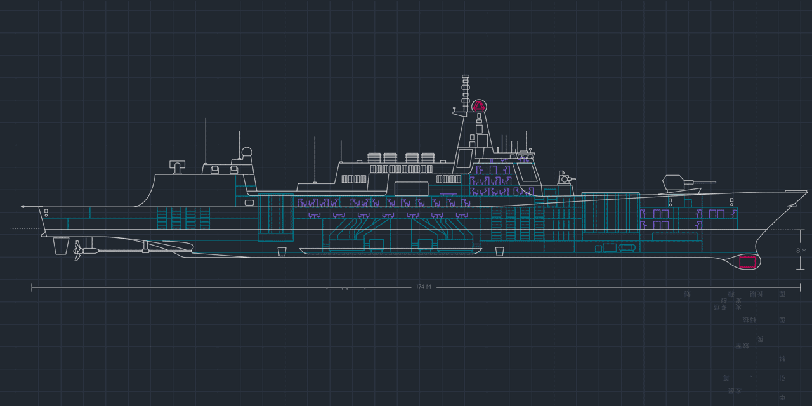
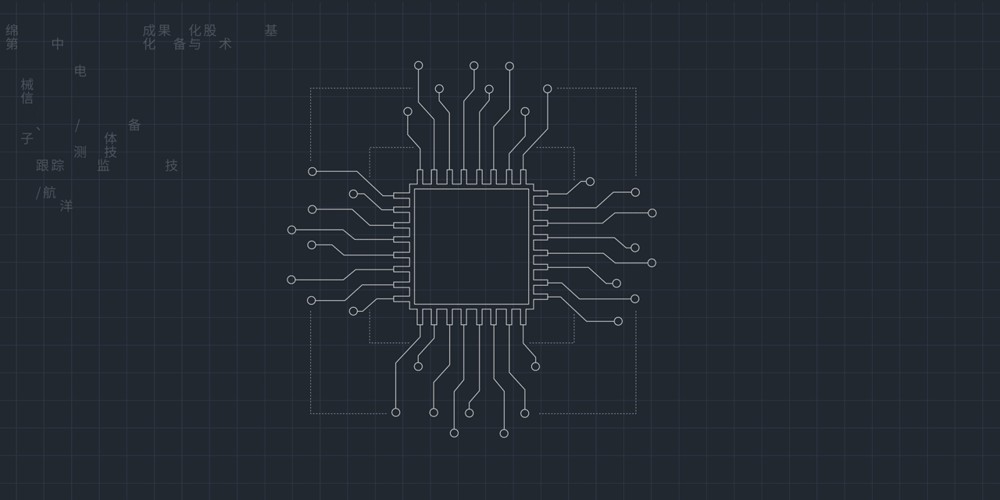

# About me

+ 
+ 
+ 
+ 

## slogan

+ 解放思想，发展生产力
+ 为天地立心，为生民立命，为往圣继绝学，为万世开太平。
+ 知行合一
+ 凡事预则立，不预则废
+ 茍日新，日日新，又日新
+ 天之道，利而不害；圣人之道，为而不争
+ 吾尝终日而思矣，不如须臾之所学也。吾尝跂而望矣，不如登高之博见也。君子生非异也，善假于物也。
+ 练得身形似鹤形，千株松下两函经。我来问道无馀说，云在青霄水在瓶。
+ 寇可往，我亦可往
+ 我的思想是全人类的财富
+ 仰望星空
+ 向上管理

## Biography

Yao-Qingsheng received the B.S. degree in Noise and Vibration Control([082502](https://gaokao.chsi.com.cn/zyk/zybk/ksyxPage?specId=73384560)) from Northwestern Polytechnical University (NPU), Xi'an, China, in 2010 and the M.S. degree in Underwater Acoustic Engineering([082403](https://yz.chsi.com.cn/zyk/specialityDetail.do?zymc=%e6%b0%b4%e5%a3%b0%e5%b7%a5%e7%a8%8b&zydm=082403&ssdm=&method=distribution&ccdm=&cckey=10)) from Northwestern Polytechnical University (NPU), Xi'an, China, in 2013. He is currently working toward the Ph.D. degree in Electronic Information(085400) with the School of Marine Science and Technology, Northwestern Polytechnical University (NPU), Xi'an, China. His research interests include Underwater Acoustic Engineering, Underwater Acoustic Target Tracking and Information Fusion.

### 主要成果展示

#### 以第一权利人获得的发明专利或软件著作权

昆明船舶设备研究试验中心（中国船舶重工集团公司七五0试验场）.要庆生.船载无线数据传输与融合显示软件.软件著作权.登记号：2021SR0256847.
+ 昆明船舶设备研究试验中心（中国船舶重工集团公司七五0试验场）.要庆生.船载式水下目标定位跟踪系统显控处理软件.软件著作权.登记号：2021SR0175434.
+ 昆明船舶设备研究试验中心.要庆生.大范围水声跟踪测量系统状态显控软件.软件著作权.登记号：2018SR124669.
+ 昆明船舶设备研究试验中心.要庆生.船载电罗经航迹航向显示软件.软件著作权.登记号：2018SR125516.
+ 中国船舶重工集团公司七五〇试验场.要庆生.大范围水声跟踪测量系统弹道处理显控软件.软件著作权.登记号：2016SR090272.

+ 吕希敬; 要庆生; 黄其培; 杨咏; 施铭珂; 何美玲.一种四自由度的水听器支架[P].云南省:CN202322600447.X,2024-04-30.
+ 王琨; 匡彪; 汤志峰; 柯有强; 宋文生; 龚浩亮; 马小勤; 要庆生; 桑国峰.一种双环自愈型水下光纤网络信号传输系统和方法[P].云南省:CN202210007443.8,2024-01-23.
+ 袁春姗; 匡彪; 黄其培; 唐济远; 要庆生; 马小勤; 万莉莉.基于水声定位的井口防喷器安装方法[P].云南省:CN202310912629.2,2023-09-19.
+ 范赞; 刘庆; 匡彪; 付传宝; 要庆生.用于水下清洗机器人的高精度相对定位方法[P].云南省:CN202211507900.6,2023-03-24.
+ 王琨; 匡彪; 汤志峰; 柯有强; 宋文生; 龚浩亮; 马小勤; 要庆生; 桑国峰.一种双环自愈型水下光纤网络信号传输系统和方法[P].云南省:CN202210007443.8,2022-05-13.

#### 论文

+ 要庆生.一种长基线阵阵元标定及位置校准方法.《鱼雷靶场》.2017，3.
+ 要庆生.基于OpenGL的水下弹道处理图形控制软件的设计.《鱼雷靶场》.2017，4.
+ 要庆生.基于同步式合作信标的水声跟踪测量系统弹道处理显控软件设计.场50周年庆征文.2019.
+ 要庆生. 四阶累积量谱线增强方法的改进仿真研究 [J]. 电子设计工程, 2014, 22 (18): 52-54. DOI:10.14022/j.cnki.dzsjgc.2014.18.075.
+ 要庆生,李钢虎,曾渊,赵亚楠,何会会. 最小方差无失真响应基础上的语音信号处理方法研究\[A\]. 中国声学会超声电子学分会、四川省声学学会、上海市声学学会、山东声学学会、陕西省声学学会、重庆市声学学会、西安市声学会、中国力学学会电子电磁器件力学工作组.2012'中国西部声学学术交流会论文集\[Ⅱ\](C).中国声学会超声电子学分会、四川省声学学会、上海市声学学会、山东声学学会、陕西省声学学会、重庆市声学学会、西安市声学会、中国力学学会电子电磁器件力学工作组:《声学技术》编辑部,2012:4.

+ 袁春姗,唐济远,要庆生. 面阵阵元位置及幅相误差有源校正算法 [J]. 舰船电子对抗, 2021, 44 (06): 78-81+116. DOI:10.16426/j.cnki.jcdzdk.2021.06.015.
+ 张庆国,黄其培,要庆生,等. 深远海水下多目标定位跟踪技术研究 [J]. 电子测量技术, 2019, 42 (22): 67-72. DOI:10.19651/j.cnki.emt.1902972.
+ 张庆国,匡彪,要庆生,等. 船载水声定位系统自动校准技术研究 [J]. 声学技术, 2018, 37 (06): 535-539. DOI:10.16300/j.cnki.1000-3630.2018.06.004.
+ 匡彪,王琨,袁春姗,要庆生.平面阵分裂波束DOA估计技术研究\[J\].声学与电子工程,2018(04):28-31.
+ 张庆国,要庆生,黄其培,等. 座底式长基线水声跟踪系统校阵方法研究 [J]. 声学技术, 2016, 35 (05): 408-413. DOI:10.16300/j.cnki.1000-3630.2016.05.004.
+ 何会会,李钢虎,要庆生,贺晓凯,石超雄.用慢特征分析算法实现水声信号盲分离\[J\].声学技术,2014,33(03):270-274.

## Contact

### Social accounts

#### 开发

[![gitcode](https://img.shields.io/badge/yaoqs-ffffff?style=flat-square&logo=data:image/png;base64,iVBORw0KGgoAAAANSUhEUgAAAGAAAABgCAMAAADVRocKAAAAPFBMVEUAAADbIEDaID7aID/bID7fIEDaID7bIEDaID7aID7bID7cIEDbID3aID/aID/aID/YID3aID7dID7aID5zWHPKAAAAE3RSTlMAIN+/7xCfQGCAkDBwz69QcM9vGOdDSAAAArBJREFUaN7tmdtS7SAMhoEknArtUt7/XbfjdmbrsiQE2gtn+905o3+aIwHN/4d9w9yBPYqvrn3gYE+BrhMv3rUTqj+uUE/Q+qAPS+oUoUm4aKflE7YR0Ns1eRlM+owfrmlwUZlaaFp2TZxesenBx3D0c5vD01h4apul0oi+a/Pssv6GbYV4s36rUnywLRKk+K/C1ipp9fP2vVQ5A14nD9YY1Bh41U2f92i/fHOKScBzTXMBg9hxmjnknvXIhK9HJTr3/rPby2Y+KM8G+iMvnv5qSFBbwzfN80M+DKfAujMDMvA1MVZRQduQgTCYAdvpSZn0KUlR1QLRKC2A5Up03oCx0QP4wuYs8mNrnbOeshfqh7NRoBXRTjn/0yN0qQPpZgcM3OyAuduB7W4HDnUXU0zewwc+pxI2UuXYserntzaEXMJom/nZiw/ukS8iOUJ14q7z0p4hNpyyCWlQAD9UZJLwR1moaJmd2D57SFNLBlgPwoQHXBTc+MJCOGzhYAxYuSllHPX7wDDkYQup38nC+85ehwKF/Y8iI0HhKMkDsG0R+nu1+hlvC2XvF9LWrSKdId+byaRZGjUF0J12WSHKdYntWa4XLXC2O2Homv3HdgdAuiYJ/V7GSQMvPZWwVkedegdmSCJdsCE+OtmZrtRXZiCQ+oYm3/OA341w0+o79hNt4y3o9Z18kDwU+gE7w5o9bTMp8itun4XZ0fQv3WjZKv4HBMVLtBBeizP/4Qj7+PNpaR2ghN4jxflHodWvJJA/XWPIHiUD6h+Ya5NA5xw2gSx2y/L79a0WnJU6fl2ft7Cuf6cFZ9WNr9eXSbP6MDod41yYknqR1b73M6w7kUm9B2pMQJj6Z7hTyuuJIKvjHswCNlf+4wuZVWz050ZcjmQugkJJO1SHf88E8DluZH75CfwBt54WqcTQWY8AAAAASUVORK5CYII=)](https://gitcode.com/yaoqs)

[![CSDN](https://img.shields.io/badge/CSDN-yaokingson-ffffff?style=flat-square&logo=data:image/x-icon;base64,iVBORw0KGgoAAAANSUhEUgAAACAAAAAgCAYAAABzenr0AAAAAXNSR0IArs4c6QAAAw9JREFUWEftlllsTVEUhr+1r5ZwO6ExxPRASU1piBiTGhJDQg2RaClp4oFGNU3MISQVIWYihpoeDNEQQ0LE8ECEFzU8iEgIMVZdWtWBuvaW49DrSk/PPdUQifV0kvPvf317rXXO3hKcmmL4iyH/Af7dCnROQlKGQOduSEw8fAli3rzCPLgLN69AdWVEk+V9BvoMRE3LRrr2ckxgqqsw549iTuyFmk/1gkQOEBWNzF6KpE5ARCLanXn2CJ0/F8oCjvrIAJo1Ry3bjvRICTMyxc8w929BeSnEt0J6D0RaJoZp9OWTmN35vwEgClmyFWX1+3uYQDF631oouhpurHzIiInIjFykuf/bO3PnOnrNvIYDSNos1PTcUPKnD9H5c+D9O+c2tO+CWr4DWrVFb1kCNy42ECChNWrbGaRpM3s3leXohekQeOU+A1YFEhLhxeOGD6Fk5qHGZ9Ya6P3rMOePuSf3oHAeQuVDFVy0v3Fr92Vv0dnjIPjZg7271BkguR++VQWh3Z87gjm4wd3Ro8IRQCZmoTJyau2+rJ0Pt655tHeXOwNkr0KlTggBzBkD70rcHT0qHAHU0u32v97qv9bo9AHWg0d7d7kzwIpdSO8BNkAwiM6wnxs7nFuwaBOqf2qoBTOHwseqxs6PM0DWQtTY9BDAskx4eO/PATBsHL6c1aHP8HgBpnDnHwTwx6H2XECaRNlz8KEMnTfFPvkijTYdoGNXKLoCpu67b73HscxdiRqeVpvO3L+NXp8HFeXuCD37oxZsRFrEoE8fxBzeVuea+u8DCYmojYWIPy4EESjGnDqAuXEBPrwPN/U1ge59kVGTkcGjEaXs6lVXomcNawCAtaTvINSiLUiU3YofYaySlrywj+XPNWBBtuuIRNsnZ5j29XN0Tuin9vO7yG5EVjlz1yDxrd1L/2ty6xDbvBism1MdERmAtdAfi6RlISMnIf5YVxBT+gZz6STm7CGoqnDURw7wwyIqGpL7IUl9oG0nJCYOrN7XfMSUBuDlE/tq/ugeaPdft3cA1717E/wH+OsV+Ao8AzlQq0l0/gAAAABJRU5ErkJggg==&logoColor=black)](https://blog.csdn.net/yaokingson)
[![博客园](https://img.shields.io/badge/cnblogs-yaoqs-ffffff?style=flat-square&logo=data:image/x-icon;base64,iVBORw0KGgoAAAANSUhEUgAAACAAAAAgCAYAAABzenr0AAAE+0lEQVRYhcWXf2hVZRjHP8/ZVeZay9mwuY1poVM2yMl0nXO3e/2RMpM0+2P7w4qQ6K8gEEwKqegPkTAqo4Lsp0UQRRQaSmYLt7Z7p5uhqxRbxrrXMce0Mda4u7v3ffrjnF33606nq75wOPd934fv8z3ned/nfK9wC6h27DxLZBNQBljAb6p6pDEUjt4oh9xM4oBtW2LJ08CLwFxVvUYoMgi8boy+9GM4HJ9xAdVlZVh35OwDdqpLcAGoBxJANVDuhX6WNPpYUzicmIovYzrJa2trGYwPbQTeBFTgBdBtDc3hw52R6NGCBQvezbCsP4EHgOWWyKWk0tbf3z8zAgrz8kga846q3iMiHw4PJ3Y2tZw0I+vRS126sKDwJywBWAcszZmb+3YkEtF0nNZ0BMSG4zlApYgYYH/o1KkJMQ0tLQAHgBhQYpnkoqk4pyUAZB6QBcRUuZiWdDjRA1wFyLCs/JUrV86QAKEfiAOzRchLF2Z8GdlANoAxGsuaPWvjjAhIJE0f8CvgA7ZPFlNbWwsidUAO0I1QDmyvrKxML+C+FSsIOPai6wkoKi42wFvecFfQ72xZv2ZNan392rVcvhS1gX3e1HvADsDO9GX4JuMUgA0bNjD098DLIuw+0RSa8tz6V63y+Wb5vgIexD37hwS+Vff3aqAO1UxEWoH9wCeAAZY2NIc6xvNlAAwODnJnbu5mYF5nJHp2KgGRri6zsKjoMCJFwHJVLUVkM/CQqi4XEQuRo6rUifAqUOQ9aFtSOTO+J1gA3d3dAGeA54N+J3MqAQANofDAsEk+Djgi8gZwHKgXkQNADcZsFuFeYHThA8XFxRO4UnVR1VYRWQxsAz64nohQ+CTASe8ag2CVbaHsZuwmr85IJCzccqSQChCj54E+4JmA3z/phrlhqGwFguNmS8Rn5Y8PTQnounIljvs0ywTdcrO5g46dB7zGxCNugdhpBXR0dAB87w13BBxnml0SVlc5PkTeByYW20WgpqZmcgEe6r27X4T0/XMSVJSXW6rsBaZ6e/bVrq70Aoyan4EuVbWAp240+doqv3Vb1pw9wM5xSx3A6Iylc27Pzk4rIPHLuThwXEQAtgb8Ttp+P4KgY2cnVQ8Cz45bOiTgAM+NmstRZVFaAWG3SRweCRZ4NF3iasch6HdsRFoYG9cDbM9QHj7RHOpF9Wvc0wWACKVpBQCgehwY9EZP3m/bY2KqqqoI+p0SSzgINEKKsA94BSi7q7Doox9CIQPQEAr3A8dcagUoGc034bzHksm+TJ+vHrfXlw5bYgPNAb+dJcg61DwBbPLER4EG4DvgSHtr29W/4pP60C+BOq+0d1dUVNDW1ja5AGMU4AtPAMDeoN/pwW2rUeA08AjQatRE9fc/Ek09PZMlTUGVY+J6iRygYCQ5pHHFAcfOE5FOXPczHglcUzKA63p6vXsP0CPQqXBekXBjc3PqdQT9zqequk1ETi+bN1Rx4JvTQBpDEu2+3Itbz17c/RDzrj6g30vY54kY8OZ6cZNfEKGDxPD4z/pBrwR550cdzLT/C+bPn0/p4sW+JOrD87Q+yzJqkqY/NmSS8bjJLyoiEomwZMkS2tvbuXgxrU0k4Pf7BD0H5EvS5J5oaUlMKeDfQNDv7AL2qGphYyjcA9N2xbcGVf0YiIlQMDL3nwpoDIW7gc9B/h8BHvbDNUt/a8bjJqBGzyLERsb/AKulzmJdLC+gAAAAAElFTkSuQmCC&logoColor=ffffff)](https://www.cnblogs.com/yaoqs)
[![开源中国](https://img.shields.io/badge/OSChina-yaoqs-ffffff?style=flat-square&logo=data:image/png;base64,iVBORw0KGgoAAAANSUhEUgAAACAAAAAgCAYAAABzenr0AAAAAXNSR0IArs4c6QAABnlJREFUWEfFVmtsU2UYfr5z6enphW5jbOvKGENQAdFu7TadyC1GnPpTDXIbCJj4w8QYExMSI1H3ixB+GEEN4SKCIyg/iNdADDcZsHUblzEYssEc27pb1/V+Ts855js6aLuxFjTxW5qsp995v+d73ud93pfgf17kgc9fU5UHSG6o2lyATAeBDUSLQ0EfGNIGI3MOuy50Zho3cwAbK0oQUlaAJy8LFr5MtPAiL7BgWQJNA+KyikhQRnhEughZPQIztxu7znenA5IewMbK6QhJnxpsxpr8GRZk5xlhtgkQjCwYloAQAo3+qYAcUxAalTDYG0ZPx6imBOWt+Lbpg8lATA5gjXsDWPJlyfwc1jF7CkwWXr+pLClQFU2/eeJiGALeyII3MAiOSOi4PIy+dn87BO4V7D1/YyIg9wew0rVVzBHeX7DQjuxpRp1eWVJB0nOmAxNEFoLI4XbbCK6d98bBaZXY42lKBTFxuJXuWmuecbPr+elgOYJwQNKpfqClAYQBrFkCujtHceVkrwKBnZmqi/FR17hfMlr5HyteLALHMfrNCfOAh6cgtWYL6LzqQ/vv3k7UeWYl/pwc+bV5BogmX+kyhym30IzgSOy+h1MBUoAggCKrUJQUQSScQtkz23hcPN0H7/WR7ahrem/s52QAK8o+ss/L3rKgKl8XUerSNA28gYVB5BANyrriqRjNNgNMVgNikTjisjIuXWOaoGgbj3cj6IvMxj7PTRr/HoAtYEhXhc+1zDFlSo6AaDiedL6mahAtvC7EW63DGOwJIxJWrkFVJIPIPVkww4qSBTmglRAN/ZM2DXqpCiZOjxWXFLQ1DqD/ZqAeBxqrkgGsclfnFJt/ci606zdJLDF6c9HMIxyQ0XKiB9Gh2A5Y2G3Y3dChR6Ze4Y99YnFY1pUusYPjWYyxFQ3LGPZGMNAdwmBvKAqNfEcM5LCy89zRZABvuLfPcue++8iCHIT8UiI3YGmuATQc70Z0MLIBdc27J6yI10s/thVbPnQtdWB0OAZvV+BvpnyxEwDZDz5+BHtbRiYWYY37tyeetS/NKzIjGkqm32w14MalIdxq7D+EQ80rJi3HNytOimZ+UTQcb9NC8iEY+YP3M6EkBpi3nr7tXFgwg+Zfiip3z6AlyPEMWk71wt8TqcCBhoZJAWyszIeiObHnwq+Z+MZdEfJvPxN0PldgNlkMutWOLWpEVOkUQCgQdmB3c08mgTPdkxbAWMNpOd2LwFB4LvZ6rmUaPJN9dwEwmyo7nc/ZZ6amgAah5Xe53ov+G74aHGz+Om3gd6oFfPZzLO2+JB9YW/7L/GfzlxcUW3X7TVyihUPf7SBaT/W24YBn3uQirDwGaG7ElDoQcgTfNB6bbP89I1pZVlvszN38qDN3XBnSPmQ08bh0tg8Drb6vcaSlZlzQLUs4XBnZm/t41qo5T+VisCeEwTsh+IciPWpI+QEC+R4lnuPYAnXiMlxb8cyUfOPZskV2veer6j1vp6bECwwYQnCtcQB9N/zXAXUPWPYyiMpAghsc85bjMZt9Tmmu7hsUNBVvwBfTjYh+fP1hLwiOsgJ3TNlZfzjZiOi3mvIu5+LCoqmFJt31EjswtWI6gtGP7mo9IcSoXRPoLplXZEFOgQgpokBO6Ad67zCyeo+QYyr+uDgEb8fobW1/48zxAFaVbcotsX1VuqhAB5A68dDvFBQdNGh5KvG/WaL/U9Z0/6CPUro3fY+CoJNSw/E78PcH3djX5BkPgD5Z5eqev7jQ4Zhl1el74EFkAsXRGJYsg66h3tbhfahrXje2bfyksa68nDcwFyqWz4DRzCE8Kv3rgYSWdkerD+313m4c9BRNLMLEp6td75myhW3lLxSB5xmEHmIko7TT1FhsBnS1+3H1TF8MRnZ2+pFsDMhKd62YY9jsXFwIegM6fNCcZzoaUvZYlkHH5SHcbBocgchXYde5ttQMTT7srXa9TXh2xxznVNCxnCo6FlV0wdGqSKKS0Bszuthozn39EXRcGsJwV/A0soyv4ouz/RMZUvppc+PTcxGWtpmnidX2mVZkTRNhsvJ6hxwbVikYWvN0igr4ohi4E0Z/V7AXcaUWB5o+z8wJ0xn3+vIqxNQ1RGSrLTZDsWDidX3QpcRVnZlwQPLLAfkMgMOY49mf6noPx0DqW+tdZZA0F0BmgcFUaAyBpvqh4U8Q5gryuLPYXh9Jd5/7l2Gmb/5H+/4CzHa6Pzi4Z3MAAAAASUVORK5CYII=&logoColor=green)](https://my.oschina.net/yaoqs)

#### 学术/scholar

[![scholarmate](https://img.shields.io/badge/scholarmate-yaoqs-ffffff?style=flat-square&logo=data:image/png;base64,iVBORw0KGgoAAAANSUhEUgAAACIAAAAiCAYAAAA6RwvCAAAAAXNSR0IArs4c6QAABmBJREFUWEelWAtsHNUVPWfGdn4Ie2dNmgY3cTybCEFJaARVCRShRKJIgCAUiAARpQjUQAu0RW29YxsMyc4amkYFqiKoihQCAZLyD+IjFGigoi1EQKqiQnbWUX4Fkp2xaQJrJ/MumvHOZrPen8mTdjWz795zz7v33XvfW2ICo7Pfa2tqVhcIuRjEAghmChAnoAP4DMReAf9JqNf8kS/e3Nk/J98oPBsRNG3vMlBugOCiRuQLMgcJrIev/T7T1+bU06tJpGvV8Fzq/rMATqsBtA/AFACxqjKClNNj9NYiU5VIIp27UoSPADihOoDc71jx24J503Y3ALi6hrGsAlYMWsZblWQqEjFTudtBrqnnTgWcFwEnBrxLRclz9XQILs9YsfXlcuOImOncMghvAiAATgIwA0C8ogHKfU4y/ovQI2l3HQTL6xEZm+dtjhW7v1S2oc3asXb3lMn5qWdAuFAoiwX8EYFpBaA9GHsu3SPDAD4A5EMKvMigAlsIOQXUFgFY6VixogeLRLoG3FkUrIJgNhB+OgHsB7gTIvtA7BbgI2h4O9tt/NtM5y6E4EaAlxcMbQT4hK78dz/pbd9bzzPzVh84uVSuSMRM5Z4BubQeQGHeERE72xN/JFjAEdH+vyvZ5s3/3afTDh5pOpuK54E8F8BCAK3HYsp7AB0BPhDff3aw76SPw2AFX4m0d76IvNEgiVBMgGTWMgYinTkpd75GbB1vuDYqyYWZZOz9kEiX7W0i5IpGiAjwGpXc4PTGd5fLmyn3uyCeDyAbwSrIrHcsYznnrfmi3R89sr9Ecde05tFTt/96xqHylBSyP5uM3VXLSEf/sDGpRb0CyFmNkmlGUzu70u61FDx2VEm2OFZ8SfRu2m6QxiB4acaKvdAIeLBXDh1ufh5gESfaW6QMKGE7gd8UM428nIm09xcRub7UgBIsGOwxtkceEeCSrGVsboREJJPoz50oLfywkH3hz1RydqY3/o/g2bS9WwG5b2yR8geadu5dgGdWMyLENdmk8cRESESyc1PeGYryfvQuGn6Y7TbeDhMk5f5MiD+GG1+wlabtfQrIt6oYesixjJXfhEQxtCnvFlCiKuoQkhZyBgS3Hw2N7GDQYbN9rTuKabjam63rmCNKzvIPDz8wkTNFNcKm7f4HwKk1FjRMM+32UElz0X3EXoiWcXpiE6ortbxW6OQbq8oIDtC03aAedJQJbXQsY1mX7b5KYEgoG7PJ+NPHFSLb3Q7g9EoYBP4b7JF/jct5wenQpAPCl0sUsyKSCsr68RCandr/bV3TFlGhU8g5HAsZA488DATNqxicbY4VP7PgjQsqGH1H+f5Poh5Rj1RQ4Kbp0vpxX9tgwnYtoRwQ8p18Pu/s65/5ZZhZkCuYSOWuEvKpIiBxC6C/AvGLG7iiOylXZZLxTeVznWmvs0mppUJcBOECEO3AWJE0bTdI3XNKFv05SE+gfs6uAbeVCkPR5MioHp/c4q8UIFVvtaJhfnAkCOtCsFog6Fffq6D3lWMZUxMpd0CI35bN73csY3rY9EzbfRLAMgB/cyzj/PHMy6H5CchrnGTbti7bvTioumbaWwORoDZUHEExg0IbgRfLBGzHMnrGum9qaAmpXhdwrRod6tFbWr+qCkg8lh/J/3TS5ClzNSV/DZwBcIVjxdYlbPdFAS6upCvAzRS8BSL0YHEomRV08qMHo7S7WRQ2UGQnNP694r4QuSvTE+83V+cWQQsz6sTiFqf6vhrRd+gtMgigbZw+eYevH/6zfqTpfyVz9zqWEYaqSCRxT65DH9WbfU2dI0SFU7bcnbHid5ppbylEHi/cZUrt7RmZfGjepPwJN0bN7FgyY1ePqJsD8vmkUd/8qH/6wWOIREqm7Qbt+Z5SEAKbM5ZxScL2rhPIo9XCxshjdu4zgNPLiKxzrPiKIhFqS5xk25ZIZtwpPpHK/VLItceCcJNQtlDwYDUShd/zgDwM8NYKcg9wVHqlhcOVOnrF60Qi7SZFYNcxOsFp9omvPaXp6gcNXbCOhsi7bGx14SXruIeAP85asWeqhrWWhVnpoVgz/LUQrjgeJgQ2KA03Z7uN4OJVcTR000usGjJFk+7wr4kGhwCHKHhc6fzTYHcsODLWHA0RiRDCdiBcDCUXgmFLn1kI3VQAu0DsgWAbRV7KT/ly655ffadqYSxn9TU0I6yLd+/9BwAAAABJRU5ErkJggg==&logoColor=000000)](https://www.scholarmate.com/P/yaoqs)

[![CNKI](https://img.shields.io/badge/CNKI-ffffff?style=flat-square&logo=data:image/x-icon;base64,AAABAAEAEBAAAAEAIABoBAAAFgAAACgAAAAQAAAAIAAAAAEAIAAAAAAAQAQAAAAAAAAAAAAAAAAAAAAAAAA/h///P4f//z+H//8/h///P4f//z+H//8/h///P4f//z+H//8/h///P4f//z+H//8/h///P4f//z+H//8/h///P4f////////R0dH/Y2Nj/0ZGRv/o6Oj//////6mpqf+wsLD//f39////////////////////////////P4f//z+H/////////////+bm5v9ISEj/f39//+fn5/8HBwf/V1dX//n5+f///////////////////////////z+H//8/h/////////Hx8f//////6urq/1BQUP+FhYX/WFhY/9ra2v//////6urq//T09P////////////////8/h///P4f//+Xl5f9NTU3/YmJi/9jY2P+Hh4f/oqKi//7+/v//////39/f/zo6Ov9ERET/l5eX/9nZ2f/9/f3/P4f//z+H///m5ub/FhYW/xAQEP9DQ0P/ISEh/3d3d//q6ur//v7+/3Jycv8tLS3/f39//wMDA/9QUFD/8vLy/z+H//8/h////////9TU1P+6urr/wsLC/1lZWf8AAAD/Pj4+/9zc3P9LS0v/dXV1//////+dnZ3/VVVV//v7+/8/h///P4f///////////////////T09P+SkpL/Hx8f/6enp//f39//HBwc/2hoaP/4+Pj/+fn5/1RUVP/CwsL/P4f//z+H/////////////9ra2v+RkZH/IyMj/yEhIf/W1tb/+Pj4/6SkpP+Ojo7/Z2dn/42Njf8wMDD/Q0ND/z+H//8/h/////////////+EhIT/AAAA/wAAAP8AAAD/Ghoa/7e3t///////+/v7/8bGxv90dHT/NDQ0/4CAgP8/h///P4f/////////////6urq/y8vL/8RERH/Y2Nj/xAQEP8SEhL/2dnZ/////////////////+bm5v/z8/P/P4f//z+H//////////////////+1tbX/BgYG/8jIyP/Kysr/dXV1/+fn5////////////////////////////z+H//8/h///////////////////5+fn/xQUFP9MTEz/6urq//////////////////////////////////////8/h///P4f//////////////////+rq6v8oKCj/AgIC/6Ghof//////////////////////////////////////P4f//z+H///////////////////x8fH/Z2dn/3d3d//z8/P//////////////////////////////////////z+H//8/h///P4f//z+H//8/h///P4f//z+H//8/h///P4f//z+H//8/h///P4f//z+H//8/h///P4f//z+H//8/h///AAAAAAAAAAAAAAAAAAAAAAAAAAAAAAAAAAAAAAAAAAAAAAAAAAAAAAAAAAAAAAAAAAAAAAAAAAAAAAAAAAAAAA==&logoColor=white)](https://www.cnki.net/)

#### 社交/Social Intercourse

### Count

Visitor Count

### My Skills

### &#x1f4c8;Github

## References

+ 
+ 
+ [shields.io](https://shields.io/)
+ [badgen.net](https://badgen.net/)
+ [用 Substats 和 Shields.io 为你的个人主页定制动态数据小牌子](https://sspai.com/post/59593)
+ [badges](https://www.oschina.net/p/badges)
+ [网站徽章shields制作教程](https://blog.csdn.net/qq_45173404/article/details/123728687)
+ [用 Shields.io 数据牌 + GitHub 统计卡片美化你的 GitHub profile](https://blog.csdn.net/Wonz5130/article/details/108417017)

## 42

+ 
+ 
+ 
